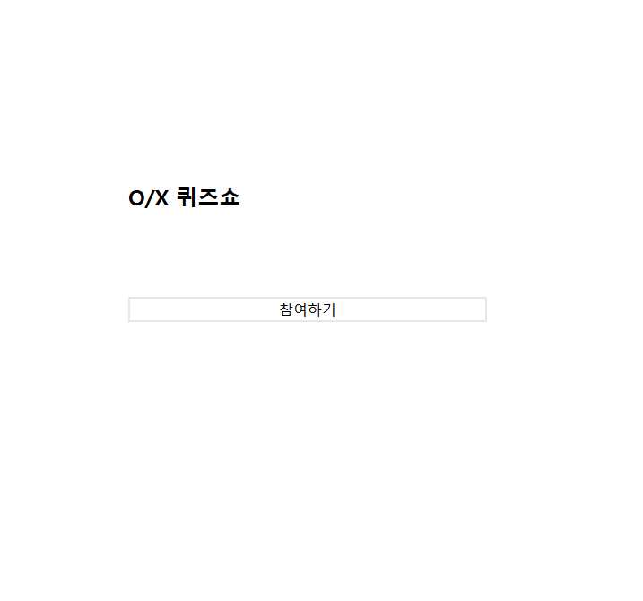
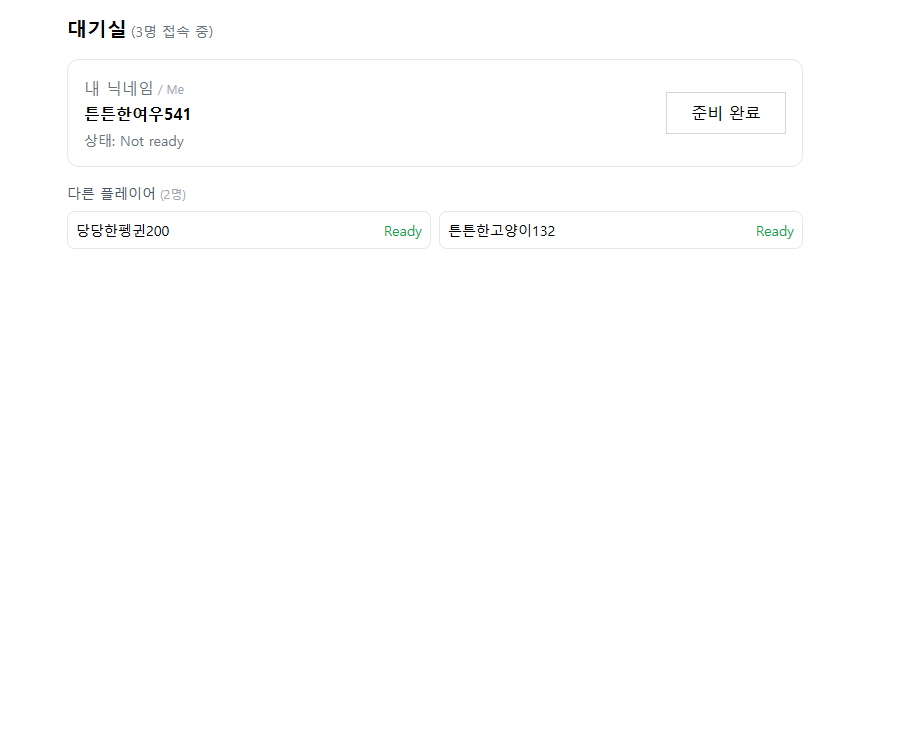
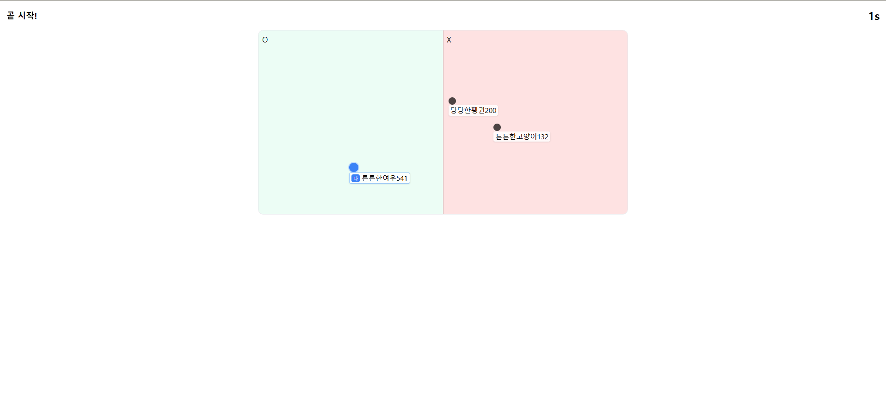
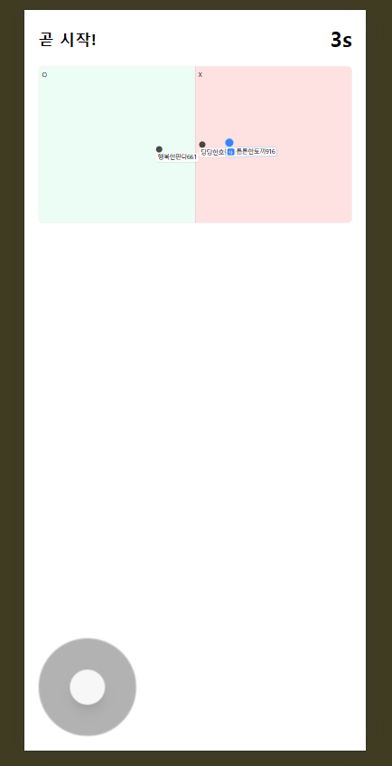

# 🕹️ Socket OX Game – 실시간 멀티플레이 OX 퀴즈 게임

> WebSocket 기반으로 여러 명의 플레이어가 동시에 접속해  
> WASD로 캐릭터를 조작하며 O/X 구역으로 이동하는 실시간 퀴즈 게임입니다.

---

## 📌 프로젝트 소개

Socket OX Game은 **“실시간 상호작용”과 “게임 로직”을 직접 구현해 보고 싶어서** 만든 멀티플레이 웹 게임입니다.

- 서버에서 게임 상태와 타이밍을 관리하고,
- 클라이언트는 WASD 입력 또는 모바일 조작 패드로 캐릭터를 움직이며,
- 출제된 문제의 정답이라고 생각하는 구역(O 또는 X)으로 이동해 **탈락을 피하는 방식**의 게임입니다.

단순한 애니메이션이 아니라, **서버 tick(20fps) 기반의 상태 동기화와 입력 처리**를 통해  
네트워크 지연과 여러 이벤트가 동시에 발생하는 상황에서도 안정적으로 동작하도록 설계했습니다.

---

## 🚀 Deployment & Repository

🔗 **Live Demo (Frontend Deploy)**  
[https://socket-oxgame.onrender.com/](https://socket-oxgame.onrender.com/)

🖥️ **Backend Repository**  
[https://github.com/didgmltmd/socket_OXgame_server](https://github.com/didgmltmd/socket_OXgame_server)

---

## ✨ 주요 기능

### 🎮 실시간 멀티플레이

- 여러 플레이어가 동시에 방에 접속해 게임 진행
- 각 플레이어의 위치, 상태(생존/탈락) 등을 서버 기준으로 동기화
- 접속/퇴장 시 플레이어 목록 및 필드가 실시간 반영

### ⌨️ WASD & 모바일 조작 지원

- PC: 키보드 **W/A/S/D**로 캐릭터 이동
- 모바일: 화면 조이스틱/패드로 입력 → 동일한 이동 로직으로 처리
- 입력은 클라이언트에서 수집해 서버 tick마다 처리 → **부드러운 움직임 + 서버 권위 구조**

### 🟢 OX 퀴즈 라운드 시스템

- 라운드마다 문제 출제 후 제한 시간 카운트다운
- 플레이어는 O 또는 X 구역으로 이동해 정답 선택
- 정답 공개 후, 오답 구역에 있는 플레이어는 탈락 처리
- 모든 라운드가 끝나면 최종 생존자(또는 없는 경우) 결과 화면 표시

### 👀 관전자 / 탈락자 처리

- 탈락한 플레이어는 더 이상 캐릭터를 조작할 수 없고 **관전자 모드**로 전환
- 관전자도 다른 플레이어의 움직임과 결과를 실시간으로 볼 수 있음

### 🧠 게임 상태 관리 & 동기화

- 서버 기준 게임 상태: `대기 → 문제출제 → 이동시간 → 정답공개 → 결과` 등 단계로 구분
- 각 단계마다 클라이언트에 필요한 정보만 전송 → 불필요한 네트워크 트래픽 최소화
- **입력 이벤트와 게임 클럭이 어긋나는 문제**를 해결하기 위해  
  - 20fps tick 내에서 입력 상태를 모아 처리하는 구조로 설계

---

## 🛠 기술 스택

### Frontend

| 구분 | 기술 |
|------|------|
| Framework | React |
| Language | TypeScript |
| 통신 | socket.io-client (WebSocket) |
| 렌더링 | Canvas / div 기반 필드 렌더링 및 스케일 조정 |
| 스타일 | CSS / TailwindCSS  |

### Backend

| 구분 | 기술 |
|------|------|
| 런타임 | Node.js |
| 서버 프레임워크 | Express (선택) |
| 실시간 통신 | socket.io |
| 게임 루프 | setInterval 기반 tick(20fps)으로 게임 상태 갱신 |
| 상태 관리 | 메모리 상에 players, gameState, room 정보 관리 |

※ 실제 사용한 라이브러리/툴은 프로젝트에 맞게 수정해 주세요.

---

## 🧩 게임 흐름

1. **입장 / 닉네임 입력**
   - 소켓 연결 후 닉네임을 입력하면 게임 로비 / 필드로 입장

2. **대기 상태**
   - 일정 인원 이상 모이거나, 진행자가 시작하면 게임 시작

3. **문제 출제 & 이동 시간**
   - 문제와 제한 시간이 화면에 표시
   - 플레이어는 WASD/조이스틱으로 O 또는 X 구역으로 이동

4. **정답 공개 & 탈락 처리**
   - 서버에서 정답을 판단하고, 오답 구역에 있는 플레이어를 탈락 상태로 변경
   - 남은 플레이어가 0명 또는 1명일 때는 게임 종료 조건 처리

5. **결과 화면**
   - 최종 생존자(우승자) 또는 전원 탈락 여부를 표시

---

## 📸 Screenshots & 주요 기능

### 🏠 1. 입장 

- 소켓 연결 상태 확인
- 추후 로비/방 선택 기능 확장 가능 구조

- 현재 접속자 수 표시
- 준비완료 상태 여부 표시
- 인원이 준비되면 게임 자동 시작
- 모바일/PC 모두 동일한 인터랙션 적용

- WASD 키로 캐릭터 이동
- O/X 구역 기반 정답 선택
- 서버 tick(20fps) 기반으로 캐릭터 움직임 동기화
- 문제 표시 → 이동 타이머 → 정답 공개 UI  
  **단계 기반 실시간 게임 상태 전환**
- 플레이어 상태 표시: 이름, 생존여부(탈락자는 관전 모드 전환)

- 가상 조이스틱 UI 제공 → 모바일에서도 동일 조작 경험
- UI/버튼 영역 분리로 오작동 최소화
- 입력 이벤트는 PC와 동일하게 서버 tick에서 처리  
  → 플랫폼 관계없이 **공정한 게임 진행**
- 화면 크기에 따라 필드 자동 스케일 조정

- 정답 표시 & 탈락자 리스트 공개
- 최종 라운드 종료 시 승자/전원탈락 결과 표시
- 재시작 또는 로비로 돌아가기 UI 구성 가능
- 게임 종료 후 관전/재도전 사용자 흐름 지원

